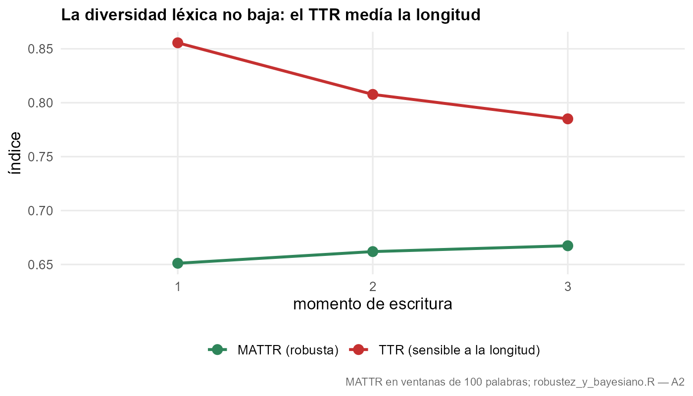
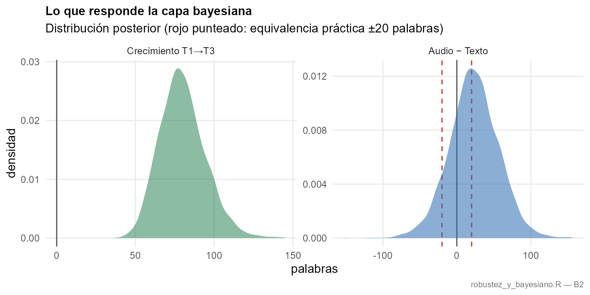
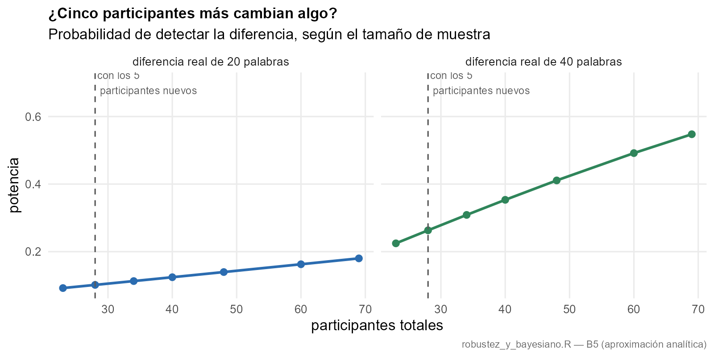
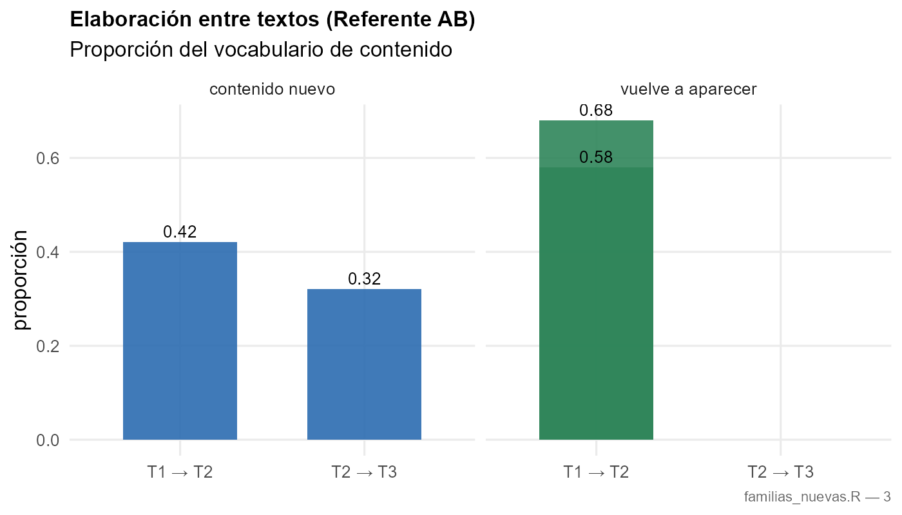
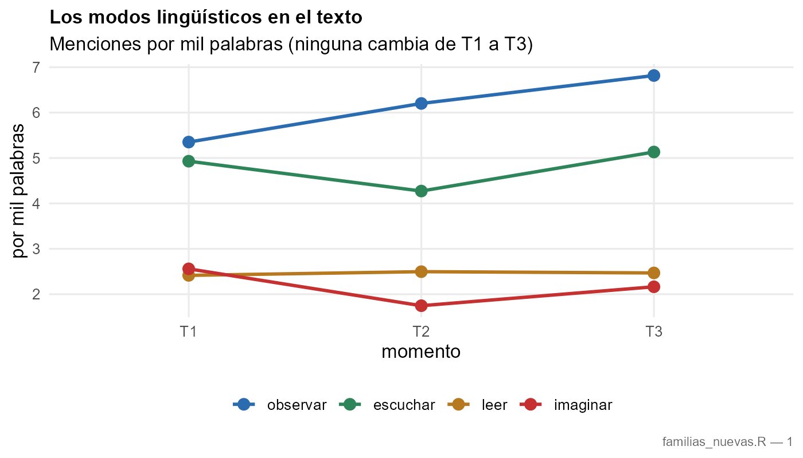
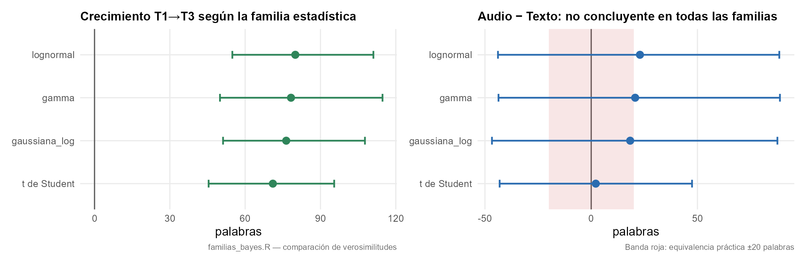
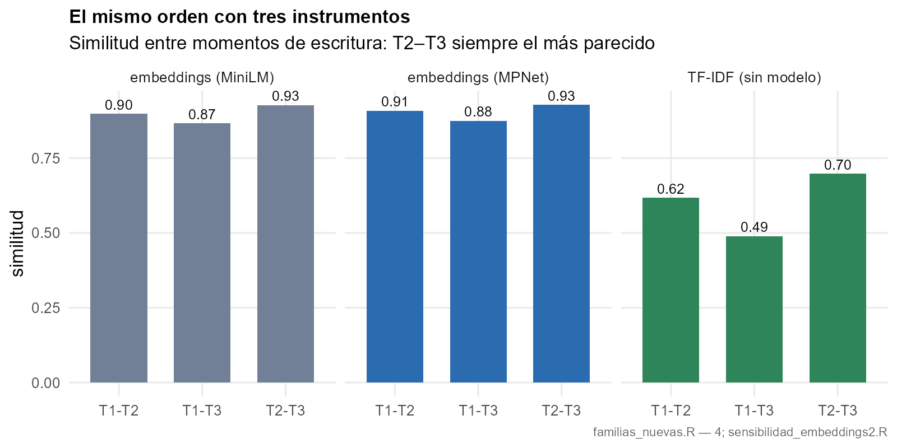

# Resultados de la corrida del 29 de septiembre de 2026

**Cohorte:** principal — 23 participantes (8 Texto, 8 Audio, 7 Imagen), 69 textos (T1 + T2 + T3).
**Ventana de ejecución:** 29 de septiembre de 2026, **17:37:59 a 18:45:44** (hora del centro de México, UTC−6).
**Carpeta de trabajo:** `Analisis agosto v2` (salida local) — este directorio conserva la copia versionada.

Estos análisis **no modifican la corrida original** ni ninguna cifra del manuscrito: leen sus artefactos y agregan
comprobaciones. El guion verificado `Experimento ALC_v5_corregido.R` (v5.9) permanece intacto.

---

## Horas de cada bloque

| Bloque | Guion | Inicio | Fin |
| --- | --- | --- | --- |
| Robustez + capa bayesiana | `robustez_y_bayesiano.R` | 17:37:59 | 17:47:56 |
| Familias nuevas del artículo | `familias_nuevas.R` | 17:53:34 | 17:57:54 |
| Comparación de verosimilitudes | `familias_bayes.R` | 18:00:17 | 18:41:54 |
| Segundo modelo de embeddings | `sensibilidad_embeddings2.R` | 18:03:09 | 18:28:02 |
| t de Student corregida | `familias_bayes_student.R` | 18:42:53 | 18:45:44 |
| Figuras del informe | `figuras_nuevas.R` | — | posterior a los bloques |

Los registros completos con marca de tiempo están en `registros/`.

**Entorno:** R 4.6.1 (2026-06-24 ucrt) · brms con backend de Stan (CmdStan 2.38.0 / rstan) · semilla única
`20260925` y 4 cadenas × 2000 iteraciones (1000 de calentamiento) en todos los modelos bayesianos ·
embeddings con `paraphrase-multilingual-MiniLM-L12-v2` (384 dimensiones, el del pipeline) y
`paraphrase-multilingual-mpnet-base-v2` (768 dimensiones, el segundo modelo) · semilla de Python sin fijar
(la codificación es determinista para vectores normalizados).

---

## 1. Robustez

| Prueba | Resultado |
| --- | --- |
| Influencia por participante (dejar uno fuera) | coeficiente de crecimiento 51 palabras; al excluir a cada persona se mueve entre **43.1 y 57.9** (cambio máximo 7.9). Ninguna persona sostiene el efecto |
| MATTR (ventana de 100 palabras) | efecto de tiempo F(2, 15.4) = **3.70, p = .049**; medias 0.651 → 0.662 → 0.667 |
| Temas con corrección FDR | de los diez diccionarios, sólo `soledad` conserva efecto de tiempo (**p FDR = .029**) |
| Bootstrap por participante (200 réplicas) | primer contraste de tiempo IC 95 % **[24.2, 80.0]** palabras |

**Hallazgo que cambia una lectura:** el TTR desciende porque el texto crece. Con un índice robusto a la longitud
la diversidad léxica no baja. El descenso del TTR no debe leerse como empobrecimiento del vocabulario.



## 2. Capa bayesiana

| Pregunta | Estimación | IC creíble 95 % | Lectura |
| --- | --- | --- | --- |
| Crecimiento T1→T3 | **80 palabras** | [54.9, 111.1] | cambio sustancial — P(>0) = 1.000, P(>20 palabras) = 1.000 |
| Audio frente a Texto | 22.9 palabras | [−43.9, 88.5] | **no concluyente** — P(dentro del ROPE ±20) = 0.372 |

- Comparación de modelos (LOO): el modelo **sin** el factor modalidad predice mejor (ΔELPD 4.6, EE 1.0).
- Sensibilidad al prior: el coeficiente de tiempo cambia 10.4 % al ampliar el prior; la conclusión no cambia.
- Potencia aproximada, diferencia real de 20 palabras: n=23 → 0.09; **n=28 → 0.10**; n=40 → 0.12.
  Diferencia mínima detectable al 80 % con n=28: **~85 palabras**.
- Cohorte piloto (17): el coeficiente de tiempo es más frágil al prior (cambia 43.1 %) y los modelos son
  indistinguibles por LOO (ΔELPD 0.4, EE 2.1). Detalle en `piloto/`.





## 3. Familias nuevas derivadas del artículo

Cuatro diccionarios construidos sobre los modos lingüísticos del artículo (leer, escuchar, observar) y la
imaginación: 94 términos que el estudio no medía.

| Diccionario | T1 → T3 (por mil palabras) | p | p con FDR |
| --- | --- | --- | --- |
| contacto_leer | 2.42 → 2.47 | .985 | .985 |
| contacto_escuchar | 4.93 → 5.13 | .640 | .854 |
| contacto_observar | 5.35 → 6.82 | .627 | .854 |
| imaginacion | 2.56 → 2.16 | .609 | .854 |
| índice de los tres modos | 12.70 → 12.97 → 14.42 | .599 | — |

**Elaboración entre textos (Referente AB):** del vocabulario de contenido de T2, 0.579 provenía del texto previo;
del de T3, **0.680**; el contenido nuevo baja de 0.421 a 0.320. Prueba pareada T2 vs T3: p = .273 (tendencia
direccional, no significativa con 23 participantes).

**Similitud sin modelo (TF-IDF)** frente a embeddings: T1–T2 0.617 / T2–T3 0.698 / T1–T3 0.489, con correlación
0.82 respecto a los embeddings y el mismo orden de similitud.





## 4. Comparación de verosimilitudes y segundo modelo de embeddings

| Familia | Crecimiento T1→T3 | Audio − Texto | LOO |
| --- | --- | --- | --- |
| lognormal (la usada) | 80 [54.9, 111.1] | 22.9 [−43.9, 88.5] | −347.2 |
| gamma | 78.3 [50.0, 114.7] | 20.7 [−43.6, 88.8] | ΔELPD 2.9 frente a la lognormal (EE 6) → indistinguibles |
| gaussiana sobre el logaritmo | 76.4 [51.2, 107.7] | 18.3 [−46.7, 87.6] | no comparable por LOO: su variable es el logaritmo, no el conteo |
| t de Student (corregida) | 71 [45.4, 95.5] | 2.2 [−43.1, 47.5] | −373.6 (EE 6.9) |

La conclusión **no depende de la familia**: el crecimiento queda entre 71 y 80 palabras y el contraste entre
modalidades cruza el cero en las cuatro.

Segundo modelo de embeddings (MPNet, 768 dimensiones frente al MiniLM de 384):

| Comparación | Modelo 1 | Modelo 2 |
| --- | --- | --- |
| Similitud T1–T2 / T2–T3 / T1–T3 | 0.898 / 0.927 / 0.866 | 0.909 / 0.928 / 0.875 |
| Correlación por participante | — | **0.97** |
| Distancia T1–T3: Imagen / Audio / Texto | 3.99 / 2.38 / 1.92 | 0.14 / 0.08 / 0.05 |
| Correlación de los cambios por constructo (20 prototipos) | — | **0.77** |

El orden de similitud y el orden de distancias por condición se conservan en ambos modelos: el hallazgo semántico
no depende del instrumento. La magnitud de los cambios en los prototipos sí es parcialmente sensible al modelo.





---

## Advertencias declaradas

1. La potencia es una **aproximación analítica** basada en la distribución posterior actual y el escalado del error
   estándar con la raíz del número de participantes; no sustituye una simulación con reajustes.
2. Algunos modelos de tema presentan **ajuste singular** (varianza de participante cercana a cero).
3. Cinco observaciones del modelo principal tienen **Pareto-k > 0.7**; la comparación por LOO se hizo sin
   emparejamiento de momentos, y el sesgo que eso introduce está acotado por las diferencias reportadas.
4. La t de Student de la primera corrida colapsó a cero porque su prior de intercepto estaba en la escala del
   logaritmo mientras el modelo se ajustaba sobre conteos de palabras; se corrigió la escala y se reajustó.
5. El diseño **confunde el paso del tiempo con la acumulación de ocasiones**: no se corrige con más datos.
6. Las celdas de condición por demora agrupan entre dos y cinco personas, lo que vuelve inestimable la
   interacción triple.

## Reproducción

```bash
cd "Script en R"
Rscript --vanilla robustez_y_bayesiano.R principal
Rscript --vanilla familias_nuevas.R principal
Rscript --vanilla familias_bayes.R principal
Rscript --vanilla familias_bayes_student.R
Rscript --vanilla sensibilidad_embeddings2.R principal
Rscript --vanilla figuras_nuevas.R
```

Los guiones están versionados en `code/analisis_nuevos/`. Las salidas de cada corrida se escriben en
`Analisis agosto v2/<bloque>/<cohorte>/` con su `registro.txt`, sus tablas y, cuando aplica, su `RESUMEN.md`.
El único paso que consume tiempo en la primera ejecución es la descarga del segundo modelo de embeddings
(1.1 GB, caché de Hugging Face).

## Contenido de este directorio

| Ruta | Contenido |
| --- | --- |
| `INFORME_2026-09-29.md` | este informe |
| `figuras/` | 10 figuras de los resultados nuevos (incluye el panel compuesto) |
| `tablas/` | 21 tablas CSV de las cuatro corridas (prefijos `NUEVAS_`, `FAM_`, `EMB2_` para las derivadas) |
| `registros/` | 5 registros con marca de fecha y hora de cada bloque |
| `RESUMEN_*.md` | resúmenes en lenguaje llano de cada bloque |
| `piloto/` | resultados de robustez y capa bayesiana de la cohorte piloto (17 participantes) |
